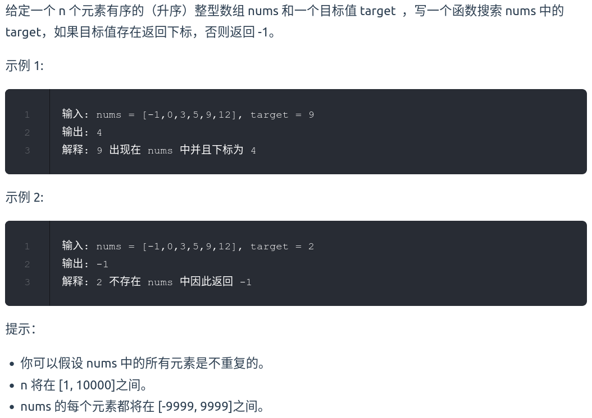
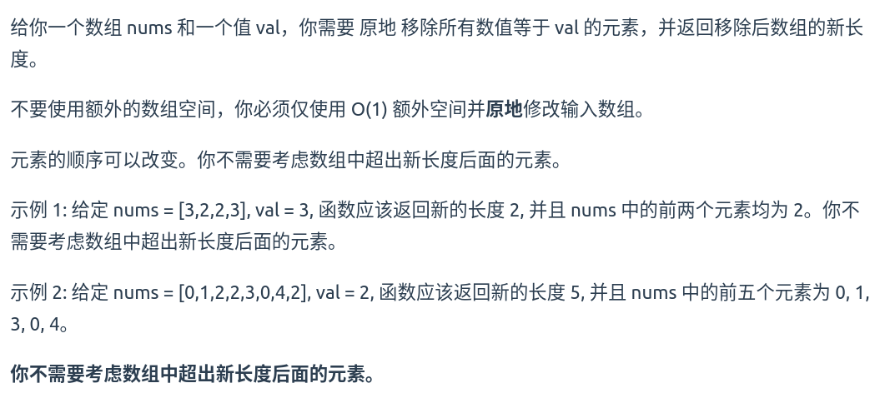
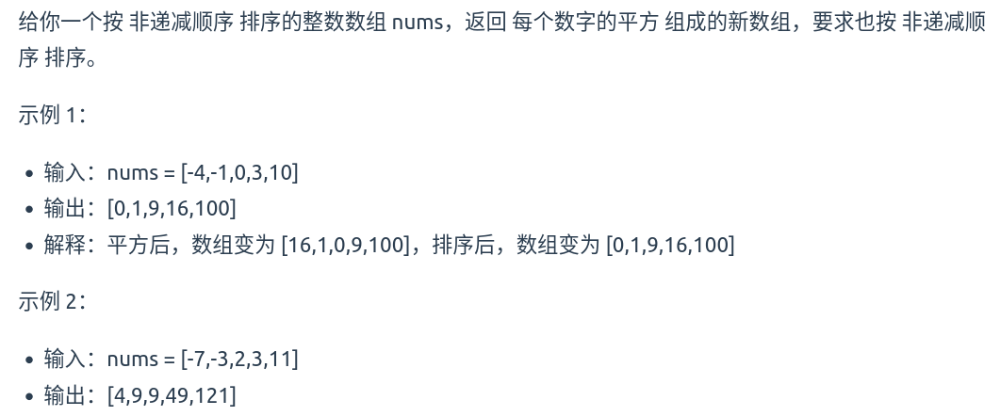
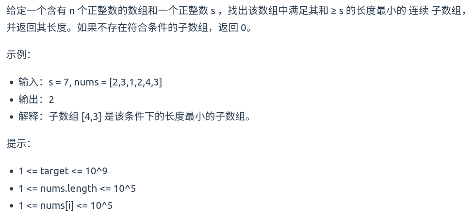
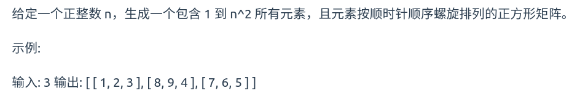
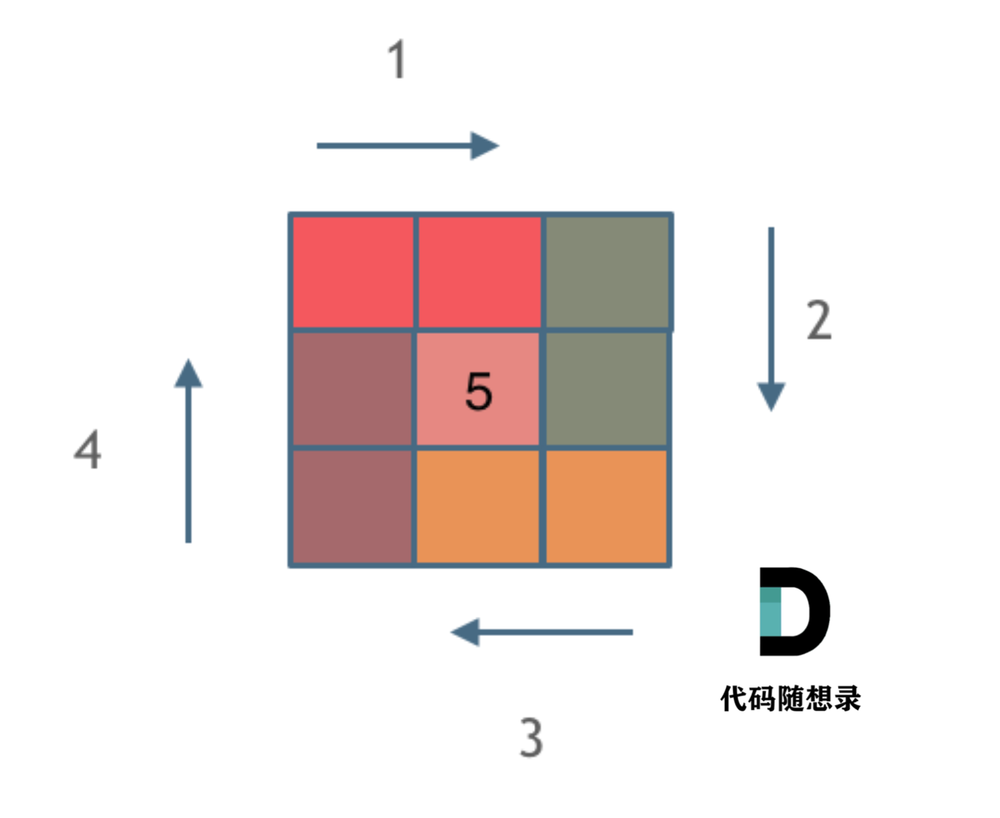

[704. 二分查找](https://leetcode.cn/problems/binary-search/)



思路：

这道题目的前提是数组为有序数组，强调数组中无重复元素，一旦有重复元素，使用二分法返回的元素下标可能不是唯一的。

```cpp
class Solution {
public:
    int search(vector<int>& nums, int target) {
		int left = 0;
		int right = nums.size() - 1;
		while (left <= right)
		{
			int mid = (left + right) / 2;
			if (nums[mid] > target) // [left, mid - 1]
			{
				right = mid - 1;
			}
			else if (nums[mid] < target) // [mid + 1, right]
			{
				left = mid + 1;
			}
			else
			{
				return mid;
			}
		}
		return -1;
    }
};
```

[27. 移除元素](https://leetcode.cn/problems/remove-element/)



双指针法

```cpp
class Solution {
public:
    int removeElement(vector<int>& nums, int val) {
        int slow = 0;
        for (int fast = 0; fast < nums.size(); fast++) {
            if (nums[fast] != val) {
                nums[slow++] = nums[fast];
            }
        }
        return slow;
    }
};
```

时间复杂度：$O(n)$

空间复杂度：$O(1)$

[977.有序数组的平方](https://leetcode.cn/problems/squares-of-a-sorted-array/)



思路：

(1) 暴力

```cpp
class Solution {
public:
    vector<int> sortedSquares(vector<int>& nums) {
        for (int i = 0; i < nums.size(); i++) {
            nums[i] = nums[i] * nums[i];
        }
        sort(nums.begin(), nums.end());
        return nums;
    }
};
```

时间复杂度：$O(n + nlogn)$

(2) 双指针

```cpp
class Solution {
public:
    vector<int> sortedSquares(vector<int>& nums) {
        vector<int> result(nums.size(), 0);
        int k = nums.size() - 1;
        for (int i = 0, j = nums.size() - 1; i <= j; ) {
            if (nums[i] * nums[i] > nums[j] * nums[j]) {
                result[k--] = nums[i] * nums[i];
                i++;
            } else {
                result[k--] = nums[j] * nums[j];
                j--;
            }
        }
        return result;
    }
};
```

时间复杂度:O(n)

[209.长度最小的子数组](https://leetcode.cn/problems/minimum-size-subarray-sum/)



思路：

**滑动窗口**，不断的调节子序列的起始位置和终止位置

```cpp
class Solution {
public:
    int minSubArrayLen(int target, vector<int>& nums) {
        int res = INT_MAX;
        int i = 0;
        int subLength = 0;
        int sum = 0;
        for (int j = 0; j < nums.size(); j++) {
            sum += nums[j];
            while (sum >= target) {
                subLength = j - i + 1;
                res = res < subLength ? res : subLength;
                sum -= nums[i];
                i++;
            }
        }
        return res == INT_MAX ? 0 : res;
    }
};
```
时间复杂度:O(n)

[59.螺旋矩阵 II](https://leetcode.cn/problems/spiral-matrix-ii/)



模拟顺时针画矩阵的过程:

    填充上行从左到右
    填充右列从上到下
    填充下行从右到左
    填充左列从下到上



```cpp
class Solution {
public:
    vector<vector<int>> generateMatrix(int n) {
        vector<vector<int>> res(n, vector<int>(n, 0));
        int loop = n / 2;
        int mid = n / 2;
        int offset = 1;
        int count = 1;
        int i = 0;
        int j = 0;
        int startx = 0;
        int starty = 0;
        while (loop--) {
            for (j = starty; j < n - offset; j++) {
                res[startx][j] = count++; 
            }
            for (i = startx; i < n - offset; i++) {
                res[i][j] = count++;
            }
            for ( ; j > starty; j--) {
                res[i][j] = count++;
            }
            for ( ; i > startx; i--) {
                res[i][starty] = count++;
            }
            offset++;
            startx++;
            starty++;
        }
        if (n % 2 != 0) {
            res[mid][mid] = n * n;
        }
        return res;
    }
};
```