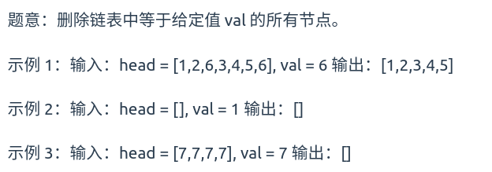
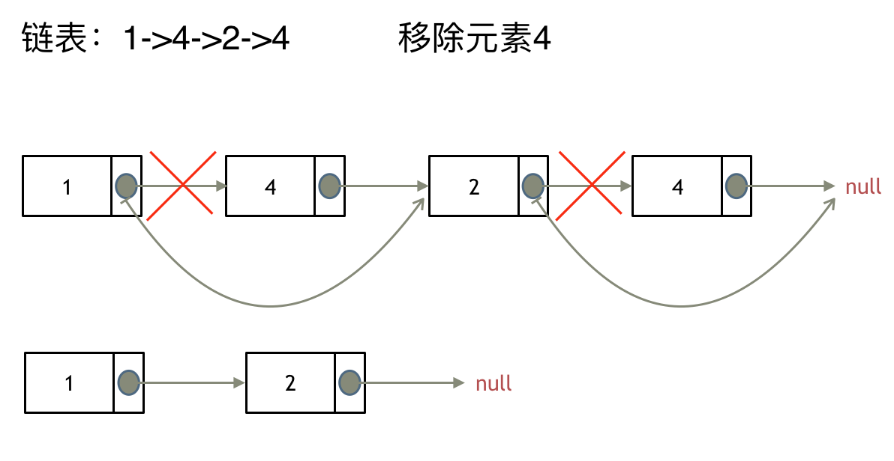
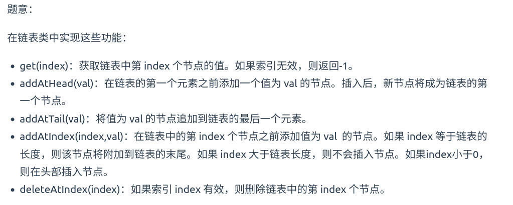
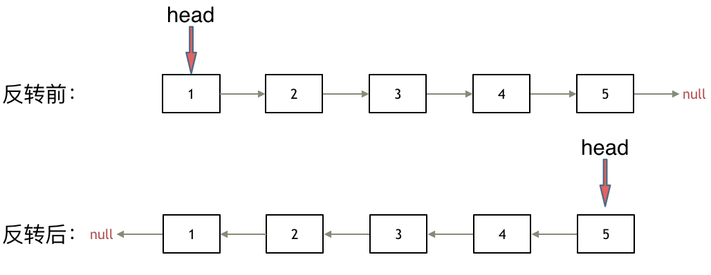
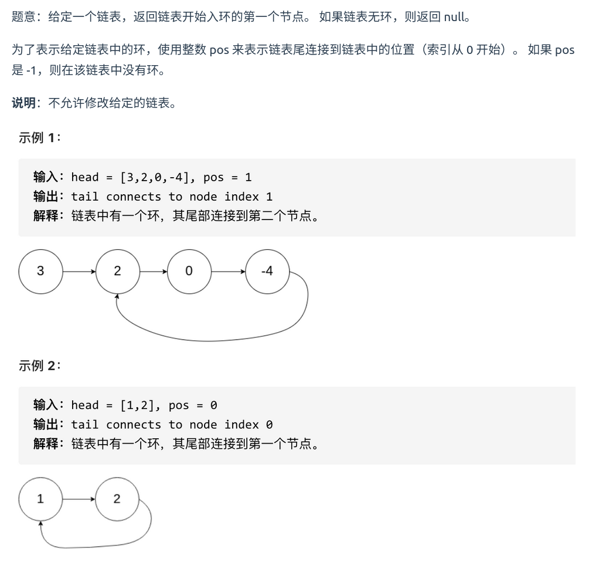

C/C++的定义链表节点方式

```cpp
struct ListNode {
    int val;
    ListNode* next;
    ListNode(int x) : val(x), next(NULL) {}
};
```

[203.移除链表元素](https://leetcode.cn/problems/remove-linked-list-elements/) 




思路：



```cpp
class Solution {
public:
    ListNode* removeElements(ListNode* head, int val) {
        ListNode* dummyhead = new ListNode(0);
        dummyhead->next = head;
        ListNode* cur = dummyhead;
        while (cur->next != NULL) {
            if (cur->next->val == val) {
                ListNode* tmp = cur->next;
                cur->next = cur->next->next;
                delete tmp;
            } else {
                cur = cur->next;
            }
        }
        head = dummyhead->next;
        delete dummyhead;
        return head;
    }
};
```

[707.设计链表](https://leetcode.cn/problems/design-linked-list/) 



```cpp
class MyLinkedList {
public:
    struct ListNode {
        int val;
        ListNode* next;
        ListNode(int x) : val(x), next(NULL) {}
    };
    MyLinkedList() {
        _size = 0;
        _dummyhead = new ListNode(0);
    }
    
    int get(int index) {
        if (index > (_size - 1) || index < 0) {
            return -1;
        }
        ListNode* cur = _dummyhead->next;
        while (index--) {
            cur = cur->next;
        }
        return cur->val;
    }
    
    void addAtHead(int val) {
        ListNode* newNode = new ListNode(val);
        newNode->next = _dummyhead->next;
        _dummyhead->next = newNode;
        _size++;
    }
    
    void addAtTail(int val) {
        ListNode* newNode = new ListNode(val);
        ListNode* cur = _dummyhead;
        while (cur->next != NULL) {
            cur = cur->next;
        }
        cur->next = newNode;
        _size++;
    }
    
    void addAtIndex(int index, int val) {
        if(index > _size) return;
        if(index < 0) index = 0;
        ListNode* cur = _dummyhead;
        ListNode* newNode = new ListNode(val);
        while (index--) {
            cur = cur->next;
        }
        newNode->next = cur->next;
        cur->next = newNode;
        _size++;
    }
    
    void deleteAtIndex(int index) {
        if (index >= _size || index < 0) {
            return;
        }
        ListNode* cur = _dummyhead;
        while (index--) {
            cur = cur->next;
        }
        ListNode* tmp = cur->next;
        cur->next = cur->next->next;
        delete tmp;
        _size--;
    }
private:
    int _size;
    ListNode* _dummyhead;
};
```

[206.反转链表](https://leetcode.cn/problems/reverse-linked-list/) 




```cpp
class Solution {
public:
    ListNode* reverseList(ListNode* head) {
        ListNode* pre = NULL;
        ListNode* cur = head;
        while (cur != NULL) {
            ListNode* tmp = cur->next;
            cur->next = pre;
            pre = cur;
            cur = tmp;
        }
        return pre;
    }
};
```

[24. 两两交换链表中的节点](https://leetcode.cn/problems/swap-nodes-in-pairs/) 


```cpp
class Solution {
public:
    ListNode* swapPairs(ListNode* head) {
        ListNode* dummyhead = new ListNode(0);
        dummyhead->next = head;
        ListNode* cur = dummyhead;
        while (cur->next != NULL && cur->next->next != NULL) {
            ListNode* tmp1 = cur->next;
            ListNode* tmp2 = cur->next->next->next;
            cur->next = cur->next->next;
            cur->next->next = tmp1;
            tmp1->next = tmp2;
            cur = cur->next->next;
        }
        return dummyhead->next;
    }
};
```
时间复杂度：$O(n)$
空间复杂度：$O(1)$


[19.删除链表的倒数第N个节点](https://leetcode.cn/problems/remove-nth-node-from-end-of-list/) 


```cpp
class Solution {
public:
    ListNode* removeNthFromEnd(ListNode* head, int n) {
        ListNode* dummyhead = new ListNode(0);
        dummyhead->next = head;
        ListNode* fast = dummyhead;
        ListNode* slow = dummyhead;
        n++;
        while (n-- && fast != NULL) {
            fast = fast->next;
        }
        while (fast != NULL) {
            slow = slow->next;
            fast = fast->next;
        }
        ListNode* tmp = slow->next;
        slow->next = slow->next->next;
        delete tmp;
        return dummyhead->next;
    }
};
```

[面试题 02.07. 链表相交](https://leetcode.cn/problems/intersection-of-two-linked-lists-lcci/) 


```cpp
class Solution {
public:
    ListNode *getIntersectionNode(ListNode *headA, ListNode *headB) {
        ListNode* curA = headA;
        ListNode* curB = headB;
        int lenA = 0;
        int lenB = 0;
        while (curA != NULL) {
            curA = curA->next;
            lenA++;
        }
        while (curB != NULL) {
            curB = curB->next;
            lenB++;
        }
        curA = headA;
        curB = headB;
        if (lenA < lenB) {
            swap(lenA, lenB);
            swap(curA, curB);
        }
        int gap = lenA - lenB;
        while (gap--) {
            curA = curA->next;
        }
        while (curA != NULL) {
            if (curA == curB) return curA;
            curA = curA->next;
            curB = curB->next;
        }
        return NULL;
    }
};
```

[142.环形链表II](https://leetcode.cn/problems/linked-list-cycle-ii/description/) 



```cpp
class Solution {
public:
    ListNode *detectCycle(ListNode *head) {
        ListNode* fast = head;
        ListNode* slow = head;
        while (fast != NULL && fast->next != NULL) {
            fast = fast->next->next;
            slow = slow->next;
            if (fast == slow) {
                ListNode* index1 = fast;
                ListNode* index2 = head;
                while (index1 != index2) {
                    index1 = index1->next;
                    index2 = index2->next;
                }
                return index1;
            }
        }
        return NULL;
    }
};
```